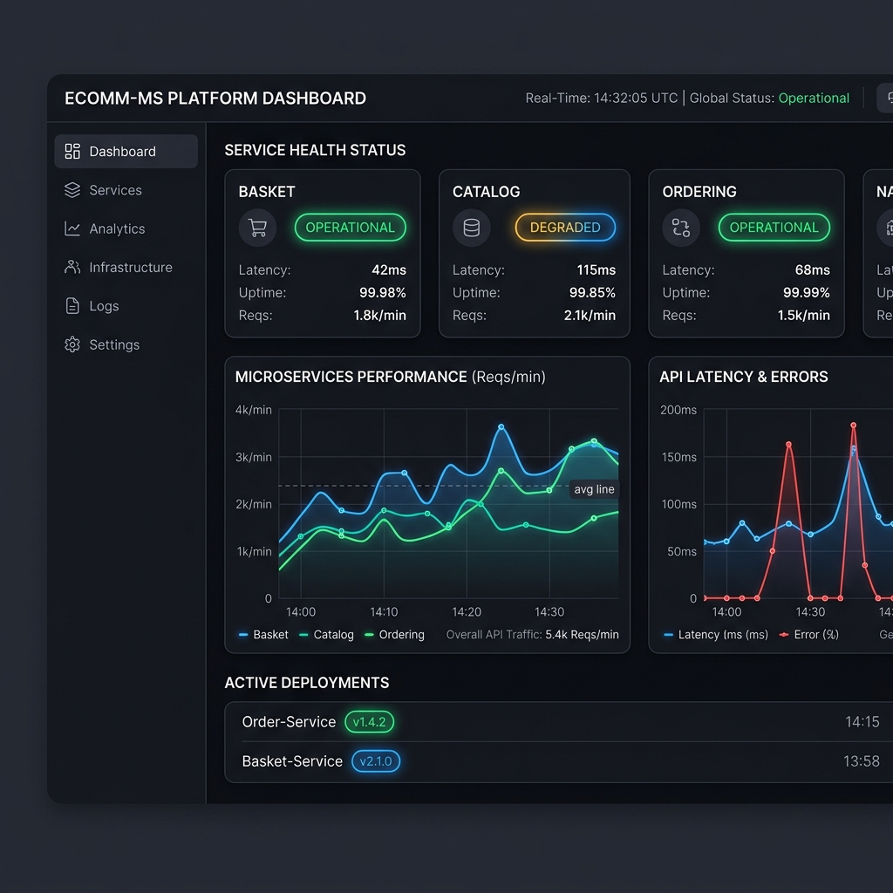
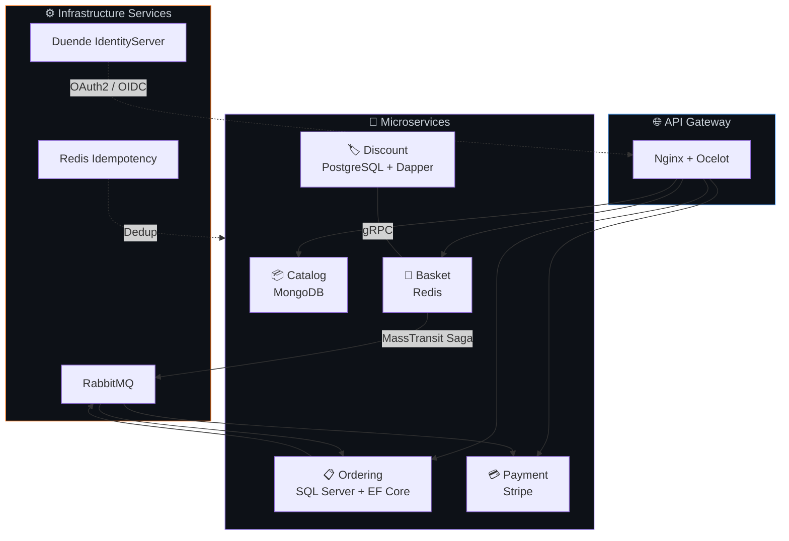
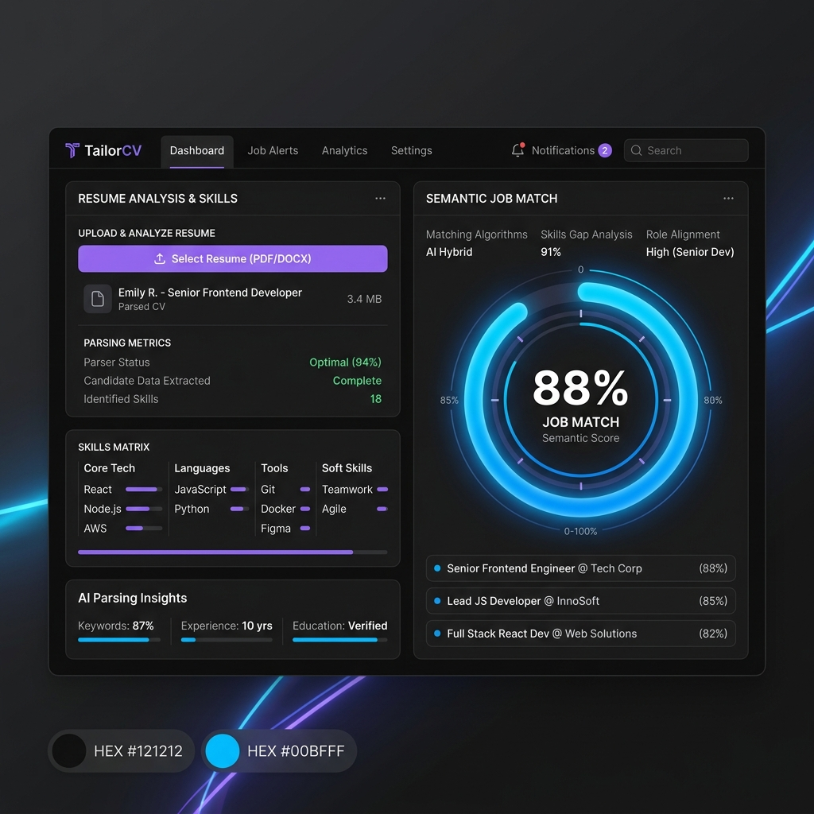
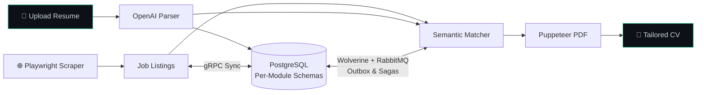
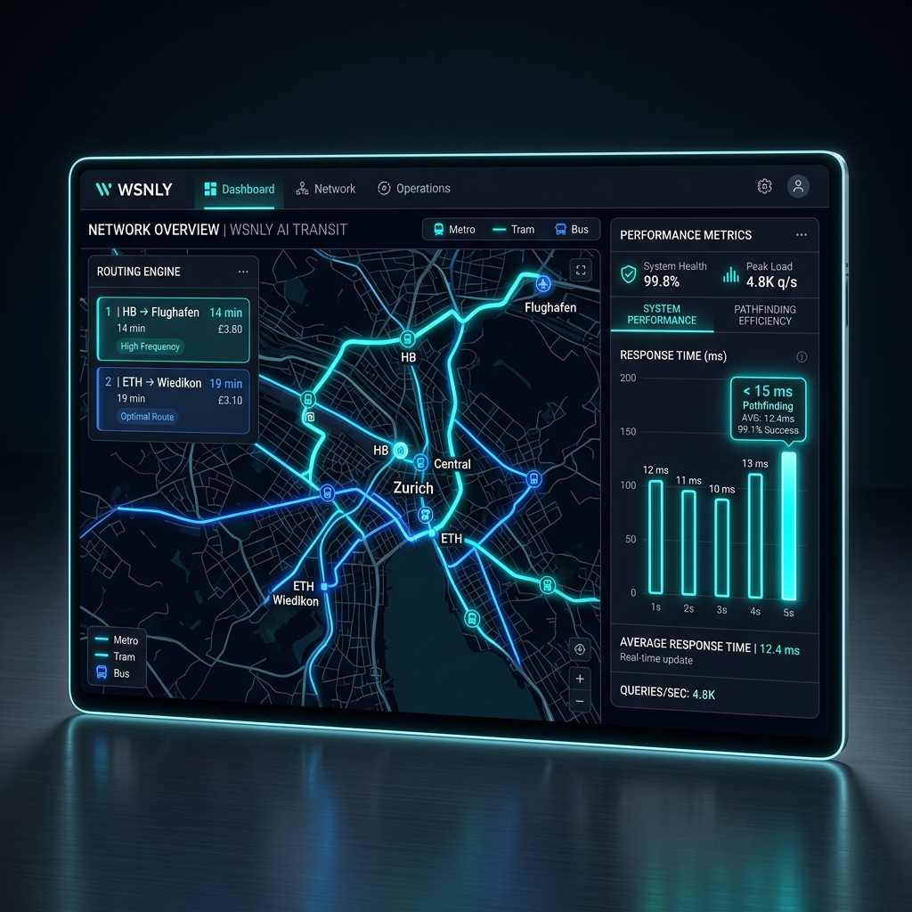
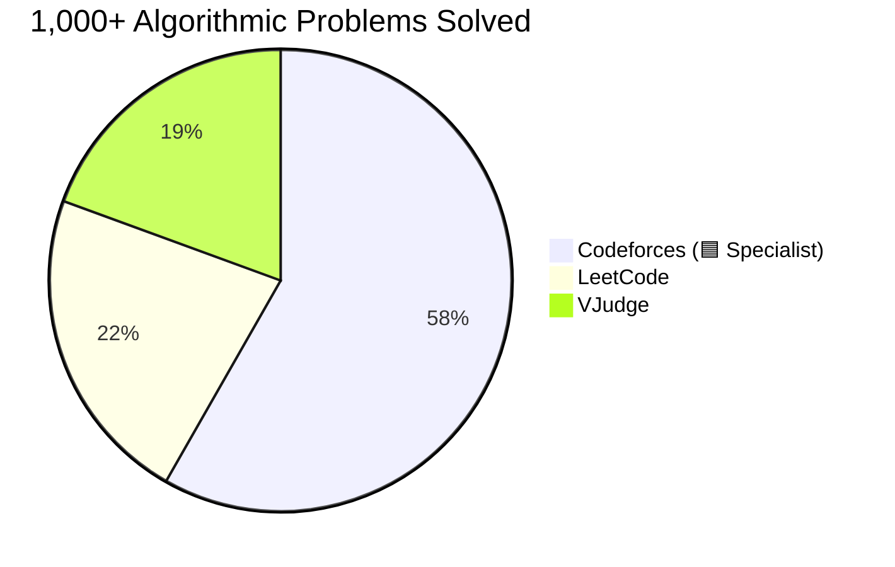

<p align="center">
  <a href="https://linkedin.com/in/abanoub-saweris"><code>🔗 LinkedIn</code></a> &nbsp;&nbsp;
  <a href="https://github.com/AbanoubPhelopos"><code>💻 GitHub</code></a> &nbsp;&nbsp;
  <a href="mailto:abanoub.saweris02@gmail.com"><code>📧 Email</code></a> &nbsp;&nbsp;
  <a href="https://codeforces.com/profile/__PoP__"><code>⚡ Codeforces</code></a> &nbsp;&nbsp;
  <a href="https://leetcode.com/u/Abanoub-Saweris"><code>🧩 LeetCode</code></a> &nbsp;&nbsp;
  <a href="tel:+201274782728"><code>📱 +20 127 478 2728</code></a>
</p>

<br/>

## 🧬 Who Am I

> *I don't just write backends — I engineer distributed systems that survive real traffic at scale.*

I am a Software Engineer specializing in high-performance architectures, event-driven microservices, and robust cloud-native infrastructures. I bring competitive programming precision to designing rock-solid production environments.

```
📍 Cairo, Egypt
🎓 B.Sc. Computer Science @ Ain Shams University (GPA: 3.0) — Expected July 2026
🏆 Codeforces Specialist · 1,000+ problems solved
👨‍🏫 Mentored 20+ software engineering students @ IClub
```

<br/>

---

## 🛸 Tech Stack Universe

| Category | Tools & Technologies |
|:---|:---|
| **Languages** | `C#` · `Python` · `C++` · `TypeScript` · `Java` · `Go` · `SQL` |
| **Frameworks & Libraries** | `ASP.NET Core` · `EF Core` · `SignalR` · `gRPC` · `MediatR` · `MassTransit` · `Wolverine` · `Ocelot` · `LINQ` · `Dapper` |
| **Data & Messaging** | `PostgreSQL` · `SQL Server` · `MongoDB` · `Redis` · `RabbitMQ` |
| **Cloud & DevOps** | `Docker` · `Kubernetes` · `Helm` · `ArgoCD` · `GitHub Actions` · `Nginx` |
| **Observability** | `Prometheus` · `Grafana` · `Loki` · `Promtail` · `OpenTelemetry` |
| **Architectures** | `Microservices` · `Clean Architecture` · `Vertical Slice` · `CQRS` · `Event-Driven` · `Saga / Outbox` · `OAuth2 / OIDC` · `REST` |

<br/>

---

## 🔩 Open Source Projects

### 🛍️ [E-Commerce Microservices](https://github.com/AbanoubPhelopos/E-Commerce)
A resilient, production-grade distributed platform featuring 6 decoupled microservices.

<table width="100%">
  <tr>
    <td width="50%" valign="top">
      <h4>⚙️ Architecture & Features</h4>
      <ul>
        <li><b>6 ASP.NET Core 10</b> microservices orchestrated behind <b>Nginx</b> & <b>Ocelot Gateway</b> using Clean Architecture & CQRS via MediatR.</li>
        <li><b>Polyglot Persistence:</b> MongoDB (Catalog), Redis (Basket), PostgreSQL + Dapper (Discount), SQL Server + EF Core (Ordering).</li>
        <li><b>Async Saga Flow:</b> Robust async checkout orchestrations via <b>MassTransit + RabbitMQ</b> integrated with <b>Stripe Payments</b>.</li>
        <li><b>Security:</b> Enforced by Duende IdentityServer (OAuth2 / OIDC) and Redis-backed custom idempotency middlewares.</li>
      </ul>
      <br/>
      <h4>🛠️ Tools & Stack</h4>
      <code>C#</code> · <code>ASP.NET Core</code> · <code>Ocelot</code> · <code>MassTransit</code> · <code>RabbitMQ</code> · <code>Redis</code> · <code>PostgreSQL</code> · <code>SQL Server</code> · <code>MongoDB</code> · <code>Duende IdentityServer</code> · <code>gRPC</code>
    </td>
    <td width="50%" valign="center">
      
    </td>
  </tr>
</table>



<br/>

### 📑 [TailorCV](https://github.com/AbanoubPhelopos/TailorCV)
An AI-powered professional resume tailoring platform that matches candidate profiles with custom scrapers.

<table width="100%">
  <tr>
    <td width="50%" valign="center">
      
    </td>
    <td width="50%" valign="top">
      <h4>⚙️ System Internals</h4>
      <ul>
        <li><b>Modular Monolith</b> designed with <b>Vertical Slice Architecture</b> in .NET 10 with CQRS pattern.</li>
        <li>Strict module isolation with distinct PostgreSQL databases schema-boundaries.</li>
        <li>Hybrid communication using <b>Wolverine + RabbitMQ</b> for outbox transactions/sagas, and <b>gRPC</b> for high-speed synchronous reads.</li>
        <li>Data pipeline utilizing <b>OpenAI API</b> for parsing/parsing, <b>Playwright</b> for automated job scraping, and <b>Puppeteer</b> for rendering PDF resumes.</li>
      </ul>
      <br/>
      <h4>🛠️ Tools & Stack</h4>
      <code>C#</code> · <code>.NET 10</code> · <code>Wolverine</code> · <code>RabbitMQ</code> · <code>gRPC</code> · <code>PostgreSQL</code> · <code>OpenAI API</code> · <code>Playwright</code> · <code>Puppeteer</code>
    </td>
  </tr>
</table>



<br/>

### 🗺️ [Wsnly](https://github.com/AbanoubPhelopos/Wsnly-Backend)
An AI-powered multimodal transit routing and query optimization system.

<table width="100%">
  <tr>
    <td width="50%" valign="top">
      <h4>⚙️ Engine Details</h4>
      <ul>
        <li>Orchestrated polyglot microservices in <b>Django (Python)</b> and a highly optimized <b>C++ engine</b> via ultra-fast <b>gRPC</b> calls.</li>
        <li>Constructed custom <b>Natural Language Processing (NLP)</b> pipeline to translate descriptive queries into geographical search bounds.</li>
        <li>Engineered a custom <b>C++ A* pathfinder</b> computing optimized routing networks across GTFS datasets in **under 15ms**.</li>
      </ul>
      <br/>
      <h4>🛠️ Tools & Stack</h4>
      <code>C++</code> · <code>Python</code> · <code>Django</code> · <code>gRPC</code> · <code>A* Search Algorithm</code> · <code>NLP</code> · <code>GTFS</code>
    </td>
    <td width="50%" valign="center">
      
    </td>
  </tr>
</table>

---

### ☁️ [Event Management System](https://github.com/6-Brain-Cells/event-management-cloud)
A high-availability, production-grade cloud-native platform.

- **DevOps Blueprint:** Implemented resilient 4-service platform built in **FastAPI** hosted behind **Nginx Gateway** implementing custom rate limiters and Correlation-ID tracking.
- **Resiliency Patterns:** Integrated **RabbitMQ Topic Exchanges** with robust Dead Letter Queues (DLQ), Circuit Breakers, and Optimistic Concurrency controls.
- **GitOps Infrastructure:** Deployments automated completely through **ArgoCD** on **Kubernetes** using custom **Helm Charts**, fully monitored via integrated **Prometheus, Grafana, and Loki**.
- **🛠️ Tools & Stack:** `Python` · `FastAPI` · `Nginx` · `RabbitMQ` · `Kubernetes` · `Helm` · `ArgoCD` · `Prometheus` · `Grafana` · `Loki`

---

### 💻 [FOS — FCIS Operating System](https://github.com/fcisProjects/FOS)
A fully modular OS Kernel written from scratch to learn micro-level system operations.

- **Memory management:** Custom dynamic allocator supporting First-Fit / Best-Fit algorithms, fully functional virtual memory page table paging, and an **Nth Chance Clock** page eviction scheduler.
- **Process scheduling:** Implemented Process tables, custom pre-emptive **Priority Round-Robin** scheduler, and synchronisation primitives (SpinLocks, sleep locks, semaphores).
- **🛠️ Tools & Stack:** `C` · `Assembly` · `OS Architecture` · `Paging` · `System Schedulers` · `Kernel Primitives`

<br/>

---

## 🏆 Competitive Programming



- **Codeforces:** 🟦 **Specialist** (Peak Rating 1400+) | Handle: [`__PoP__`](https://codeforces.com/profile/__PoP__)
- **LeetCode:** Solved **230+** algorithmic challenges | Handle: [`Abanoub-Saweris`](https://leetcode.com/u/Abanoub-Saweris)
- **Core Strengths:** `Graph Theory` · `Dynamic Programming` · `Number Theory` · `Segment Trees` · `Greedy & Constructive` · `Binary Search`

<br/>


## 📊 GitHub Contributions


<p align="center">
  <picture>
    <source media="(prefers-color-scheme: dark)" srcset="https://streak-stats.demolab.com?user=AbanoubPhelopos&theme=github-dark-blue&hide_border=true&background=0d1117&ring=58a6ff&fire=58a6ff&currStreakLabel=58a6ff" />
    
  </picture>
</p>

<br/>

<h3 align="center">Let's build something that scales 🚀</h3>

<p align="center">
  <a href="mailto:abanoub.saweris02@gmail.com">abanoub.saweris02@gmail.com</a> &nbsp;·&nbsp;
  <a href="https://linkedin.com/in/abanoub-saweris">LinkedIn</a> &nbsp;·&nbsp;
  <a href="https://codeforces.com/profile/__PoP__">Codeforces</a> &nbsp;·&nbsp;
  <a href="tel:+201274782728">+20 127 478 2728</a>
</p>
